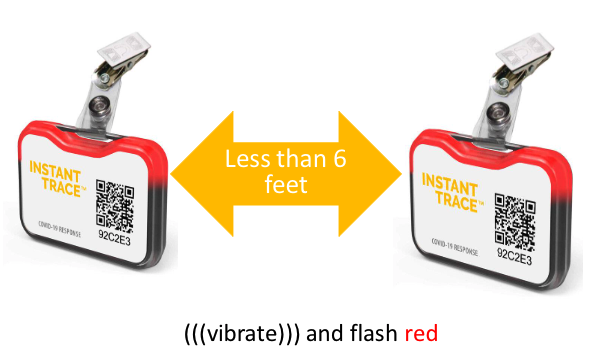

Proximity sensors
=================

While performing experiment at the APS you are required to use a Wearable Proximity Device.

For more information check:

`FAQ <https://anl.us2.list-manage.com/track/click?u=12b0bf5a3c2bf2e87f5cab8a4&id=045c7d99c9&e=ca7c1f2ce9>`_

`Kiosk locations <https://anl.box.com/s/977bgwx4bd9f9ea6kz5qg466f4k4j8xk>`_

`Training slide deck <https://anl.box.com/s/rq9xs5lb5g7gjcgborx37yzx4ak2g3ta>`_

