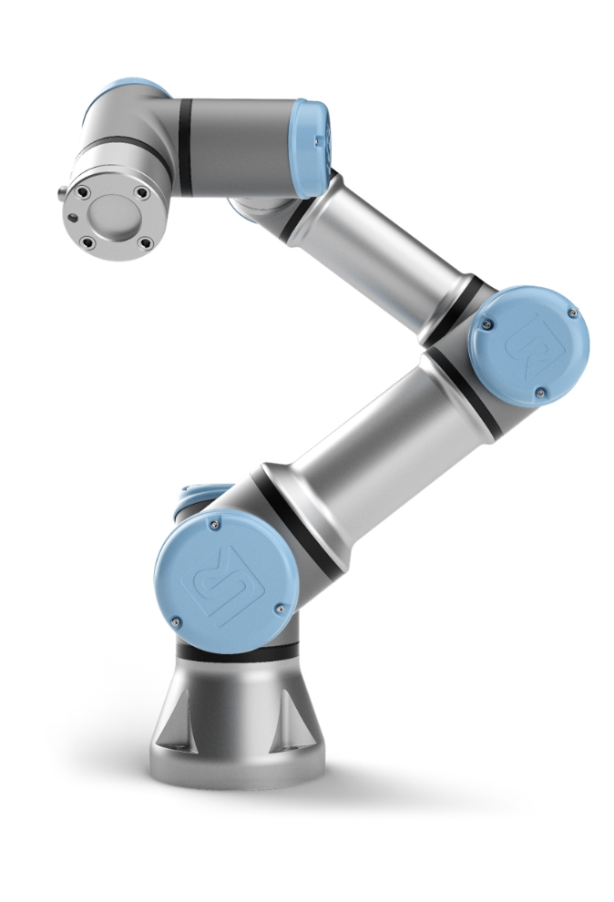
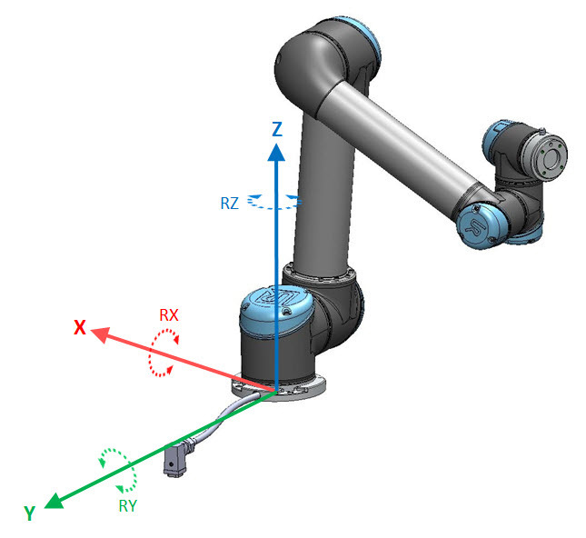
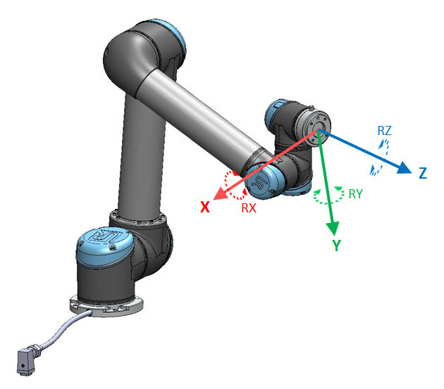
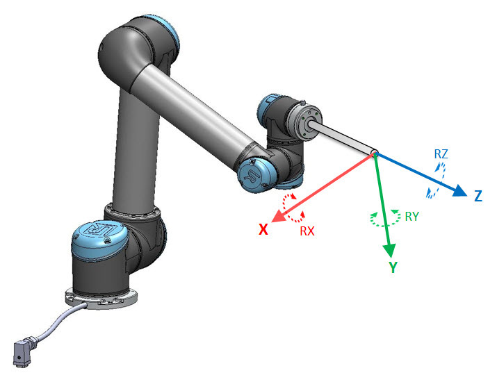

Robot
=====

The tomography instrument is using a Universal Robots e-Series for sample loading and unloading.

Coordinate System
-----------------

The Base coordinate system is a Right-hand coordinate system, where Y is into the robot cable and Z-axis upwards through the centre of the Base joint.

The Tool coordinate system is a Right-hand coordinate system, where Y is away from the Tool connector, and Z is normal to the tool flange.

The Tool offsed will shift the Tool coordinate system as shown.

Documentation:

- `Operating Instruction and safety procedure <https://anl.box.com/s/diyehzhu6jfcbnd0ocx9n43rmfmg7zde>`_
- `User Manual <https://anl.box.com/s/w2sk8msmm1gt7c2dzgk9kh77hor5irp5>`_
- `Gripper Manual <https://anl.box.com/s/jhqaawq3s6mbi8pkagzyum9bvq0s6izx>`_ 
- `Wrist Camera Manual <https://anl.box.com/s/ernzj3w56db9lecs0jjo0yw7j6uof8u7>`_
- `Mounting Hole Pattern <https://anl.box.com/s/bnvgo6yn8mjbc1a2j13lnqcwjekz5ac5>`_
- `Dashboard Server <https://anl.box.com/s/2xiozutggjlmvcfmjzqfoebv9o5905ny>`_

Testing
-------

To confirm communication wiht the robot, run `Dashboard <https://github.com/decarlof/sandbox/blob/master/robot/Remote_Examples/Dashboard.py>`_.py then type:

   Enter command: get robot model
   UR3

The full list of Dashboard server commands is `here <https://anl.box.com/s/2xiozutggjlmvcfmjzqfoebv9o5905ny>`_