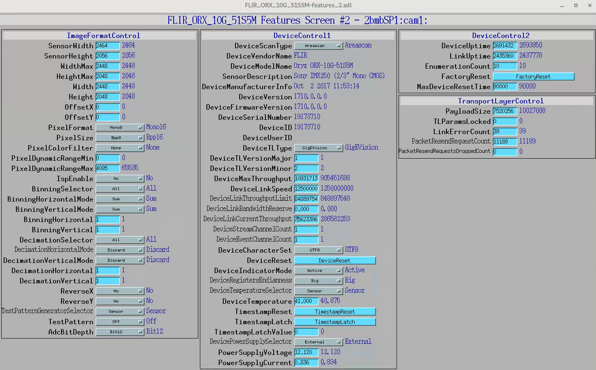
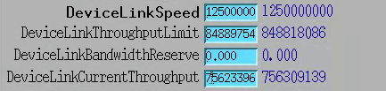

Detectors
=========

.. contents:: 
   :local:

Here we list detector specific information userful for troubleshooting and configure areadetector.

Flir
----

The area detector IOC controlling the FLIR camera run on the linux machine named pg10ge. To check the area detector status::

    user2bmb@pg10ge$ 2bmbOryx.sh status

To stop/restart area detector use ::

    user2bmb@pg10ge$ 2bmbOryx.sh start
    user2bmb@pg10ge$ 2bmbOryx.sh stop

To power cycle the camera unplug the power supply:

.. image:: ../img/flir_power.png 
   :width: 240px
   :align: center
   :alt: tomo_user

.. warning:: If the area detector fails to boot even after a camera power cycle, it means that the last auto save file (auto_setting.sav) is corrupted or that the network adaper the camera is connected to needs a reboot. To recover from the first you need to replace the corrupted auto save with a good one, if this is not avaialble just delete all autosave files. For recovering from the the network adaper issue reboot the linux machine (pg10ge) with user2bmb@pg10ge $ sudo /usr/sbin/reboot. 

    user2bmb@pg10ge$ 2bmbOryx.sh stop

then restart areadetector with::

    user2bmb@pg10ge$ ~/2bmbOryx.sh start

.. warning:: If the camera is not performing at the max speed (when set at 8-bit should run at 160 fps) but only runs at a lower speed (~95 fps or even lower) check the settings for the ISP Enable parameter is set to No. Also increase the DeviceLinkThroughputLimit up to the same value as DeviceLinkSpeed. 

.. image:: ../img/flir_IspEnable.png 
   :width: 240px
   :align: center
   :alt: tomo_user

These are located in the Camera-specific features/Features #2 screen of the ADSpinnaker.adl screen. Check also the `github issue <https://github.com/areaDetector/ADSpinnaker/issues/4>`_ for more details.

Circular Buffer
~~~~~~~~~~~~~~~

The circular buffer plug-in is used in streaming mode to store 'past' images (taken before the capture starts) so that the recording includes data ahead of the event that triggered the data saving. The maximum number of frames buffered in the NDPluginCircularBuff plugin can be increased (within the available computer memory) by editing::

    # The maximum number of frames buffered in the NDPluginCircularBuff plugin
    epicsEnvSet("CBUFFS", "1500")

in the st.cmd.base file located in /net/s2dserv/xorApps/PreBuilts/areaDetector-R3-10/ADSpinnaker-R3-0/iocs/spinnakerIOC/iocBoot/iocSpinnaker::

    user2bmb@pg10ge$ cd /net/s2dserv/xorApps/PreBuilts/areaDetector-R3-10/ADSpinnaker-R3-0/iocs/spinnakerIOC/iocBoot/iocSpinnaker
    user2bmb@pg10ge$ sublime st.cmd.base

Point Grey
----------

The area detector IOC controlling the Point Grey camera run on the linux machine named lyra. To check the area detector status::

    [user2bmb@lyra]$ 2bmbPG3 status 

To stop/stop area detector use ::

    user2bmb@pg10ge$ 2bmbPG3 start
    user2bmb@pg10ge$ 2bmbPG3 stop
