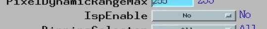

Detector restart
================

.. contents:: 
   :local:

Flir
----

The area detector IOC controlling the FLIR camera run on the linux machine named pg10ge.
To check the area detector status::

    user2bmb@pg10ge$ ~/2bmbOryx.sh status

To stop/restart area detector use ::

    user2bmb@pg10ge$ ~/2bmbOryx.sh start
    user2bmb@pg10ge$ ~/2bmbOryx.sh stop

To power cycle the camera unplug the power supply:

.. image:: ../img/camera.png 
   :width: 240px
   :align: center
   :alt: tomo_user

If the area detector fails to boot even after a camera power cycle, it means that the last auto save file (auto_setting.sav) is corrupted. To recover you need to replace the corrupted auto save with a good one::

    user2bmb@pg10ge$ ~/2bmbOryx.sh stop
    user2bmb@pg10ge$ cd ~/iocSpinnaker/autosave/
    user2bmb@pg10ge$ cp auto_settings.sav_good auto_settings.sav

then restart areadetector with::

    user2bmb@pg10ge$ ~/2bmbOryx.sh start

.. warning:: If the camera is not performing at the max speed (when set at 8-bit should run at 160 fps) but only runs at a lower speed (~95 fps or so) check the settings for the ISP Enable parameter is set to No. 

This is located in the Camera-specific features/Features #2 screen of the ADSpinnaker.adl screen.

Point Grey
----------

The area detector IOC controlling the Point Grey camera run on the linux machine named lyra. To check the area detector status::

    [user2bmb@lyra]$ 2bmbPG3 status 

To stop/stop area detector use ::

    user2bmb@pg10ge$ ~/2bmbOryx.sh start
    user2bmb@pg10ge$ ~/2bmbOryx.sh stop

