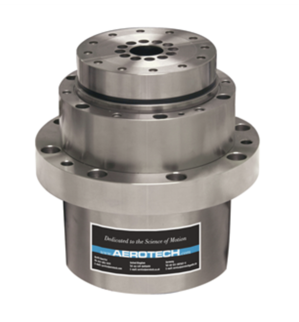

Rotary stage
============

we have different sets of rotary stages:

+-----------+--------------------+--------------------------------+-------------------+----------------+----------------------------+------------------+------------------------+--------------------------------------------------------+
| Station   | Descriptiom        |      Ensemble Settings         | Model             |  Image         | Controller                 |    Speed (rpm)   |      Load axial (kg)   |    Info                                                | 
+-----------+--------------------+--------------------------------+-------------------+----------------+----------------------------+------------------+------------------------+--------------------------------------------------------+
| 2-BM      | spindle            |             -                  | ABS2000-1000AS-RU | |00003|        | ENSEMBLEHLE10-40-A-MXH (*) |         6000     |            18          |  `box link 0004`_, `box link 0002`_, `order 0004`_     |
+-----------+--------------------+--------------------------------+-------------------+----------------+----------------------------+------------------+------------------------+--------------------------------------------------------+
| 2-BM-A    | fast tomo          |     `Ensemble Settings`_       | ABS250MP-M-AS     | |00004|        | ENSEMBLEHLE10-40-A-MXH (*) |          500     |            66          |  `box link 0004`_, `box link 0003`_, `order 0005`_     |
+-----------+--------------------+--------------------------------+-------------------+----------------+----------------------------+------------------+------------------------+--------------------------------------------------------+
| 2-BM-B    | mona tomo          |     `Ensemble Settings`_       | ABRS-150MP-M-AS   | |00004|        | ENSEMBLEHLE10-40-A-MXH (*) |          500     |            8           |  `box link 0004`_, `order 0006`_                       |
+-----------+--------------------+--------------------------------+-------------------+----------------+----------------------------+------------------+------------------------+--------------------------------------------------------+

(*) replaced with ENSEMBLEML10-40-IO-MXH

Ensemble
--------

The Ensemble Parameter Setup currently in use at 2-BM-A and 2-BM-B stations can found at `Ensemble Settings`_

+--------------------------------+--------------------------+-----------------------+-----------------+
|                                |       ABRS150MP          |         ABRS250MP     |       Units     |
+--------------------------------+--------------------------+-----------------------+-----------------+
| Fundamental Encoder Resolution |       3600               |              11840    |     lines/rev   |
+--------------------------------+--------------------------+-----------------------+-----------------+
| Encoder scale factor           |        148               |                 45    |                 |
+--------------------------------+--------------------------+-----------------------+-----------------+
| Encoder pulses per revolution  |     532800               |             532800    |     pulses/rev  |
+--------------------------------+--------------------------+-----------------------+-----------------+
| Encoder resolution             |     0.000675675675676    |  0.000675675675676    |     deg/pulse   |
+--------------------------------+--------------------------+-----------------------+-----------------+

PSO
---

Details on the Position Synchronized Output (PSO) are in the `Aerotech Manual`_ 

.. _box link 0002: https://anl.box.com/s/1ffp00cn1gjkyyelnufp0kef336t4jg9
.. _box link 0003: https://anl.box.com/s/2z5zr200vut71zv07ozsudxqhzvgnv5k
.. _box link 0004: https://anl.box.com/s/i2gkeq8qcu10lvjovbvk1ldl2a4ug57o
.. _order 0004: https://apps.inside.anl.gov/paris/req.jsp?reqNbr=F2-235109
.. _order 0005: https://apps.inside.anl.gov/paris/req.jsp?reqNbr=E8-198024
.. _order 0006: https://apps.inside.anl.gov/paris/req.jsp?reqNbr=E8-078092
.. _Ensemble Settings: https://anl.app.box.com/s/serp2nlyzk0ljvpqczc3btm7ikn9pvlj
.. _Aerotech Manual: https://anl.box.com/s/l43qkqlhy21f4a8wetmrqbeqz9c7am72

.. |00004| image:: ../img/aerotech_00002.png
    :width: 20pt
    :height: 20pt

Aerotech in 2-BM-A
------------------

There is a 46.5 degree offset between the rotary stage home and the pthysical dial 
so when asking the motor to home (by pressing HomR or HomF buttons) the home position 
reads  46.5 degree on the motor dial. To assure the user coordinate reads zero 
degree when the motor physical dial is at zero set the offset as shown in the image below.

.. image:: ../img/rotary.png 
   :width: 480px
   :align: center
   :alt: tomo_user

.. warning:: If the rotary stage stops responding to a move command check that the torque is enabled and that there is sufficient airflow to the stage. If the stage is still not responding issue a Home command by pressing HomR or HomF button in the motor debug medm screen.
