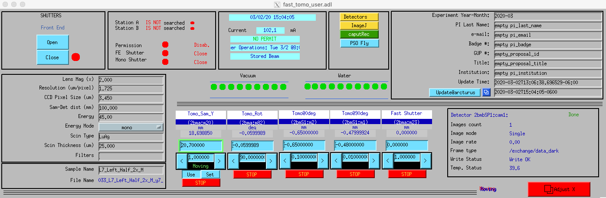

===========
User Manual
===========

The sector 2 bending magnet beamline is fully dedicated to microtomography with capability to perform large field of view (20 x 2 mm :sup:`2`) fast 2D phase contrast imaging for slow dynamic phenomena studies (0.1m/s). The applications of this beamline range from life science, geoscience, physics, material science and engineering and paleontology. The flexibility of switching setups and capabilities of developing on-demand accessory experimental techniques make this beamline versatile in tomography applications.

.. image:: img/project-logo.png
   :width: 320px
   :align: center
   :alt: project

Sample Alignment
================

.. contents:: 
   :local:

First start the tomography control user interface with::

    $ start_tomo

After loading the same move it up/down by adjusting the TomoY motor in the positive/negative direction. To center the sample on the rotation axis, rotate the sample between 0 and 180 degree and adjust Tomo@0deg till the sample is in the middle of the image at both position, then move the rotary stage at 90 deg and adjust Tomo@90deg to move the sample again in the middle of the image.

Data collection
===============

The tomography scans are managed by the `2bm tomo <https://github.com/xray-imaging/2bm-tomo>`_ python library.

To run a tomographic scan::

    $ tomo scan

from the command line. To get correct results, you may need to set specific
options, for example to collect 10 tomographic dataset at 10 vertical positions separated by 1 mm::

    $ tomo scan --scan-type vertical --vertical-scan-start 0 --vertical-scan-end 10 --vertical-scan-step-size 1

to list of all available options::

    $ tomo scan -h

For more details refer to `2bm tomo <https://github.com/xray-imaging/2bm-tomo>`_.

Data analysis
=============

At the APS
----------

Your raw data are automatically copied from the detector to the analysis computer (handyn in this example) under the folder /local/data/YYYY-MM/PI_lastName. After the transfer the data are also automatically reconstructed with:: 

    [tomo@handyn,~]$ tomopy recon --reconstruction-type try --file-name /local/data.h5

Login at the beamline Linux machine handyn as user “tomo” then type::

    [tomo@handyn,~]$ tomopy recon -h

for help. More detailed instruction are at https://github.com/tomography/tomopy-cli

To do a test reconstruction just type::

    [tomo@handyn,~]$ tomopy recon --file-name /local/data/YYYY-MM/PI_lastName/file.h5 

At your home institution
------------------------

Install the following::

    Conda: https://www.anaconda.com/download/
    tomopy: conda install -c conda-forge tomopy
    tomopy-cli: Follow the instructions at https://github.com/tomography/tomopy-cli

then you can run reconstrutions with::

    $ tomopy recon --file-name /data/file.h5

or find the rotation axis for all datasets in /data with::

    $ tomopy find_center --file-name /data/

