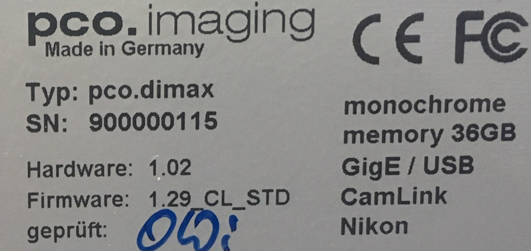
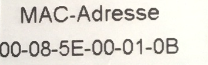
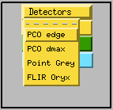
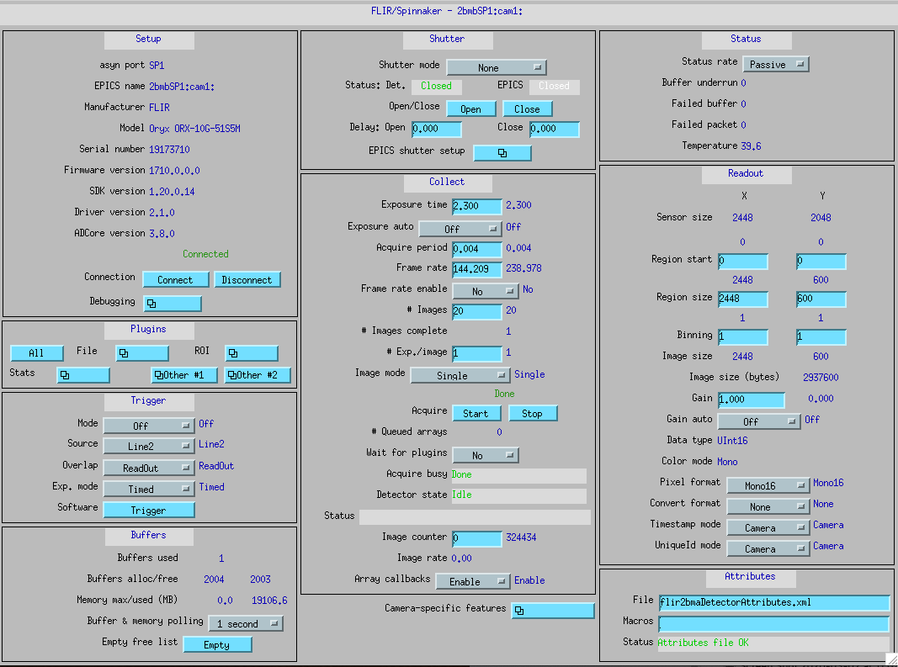
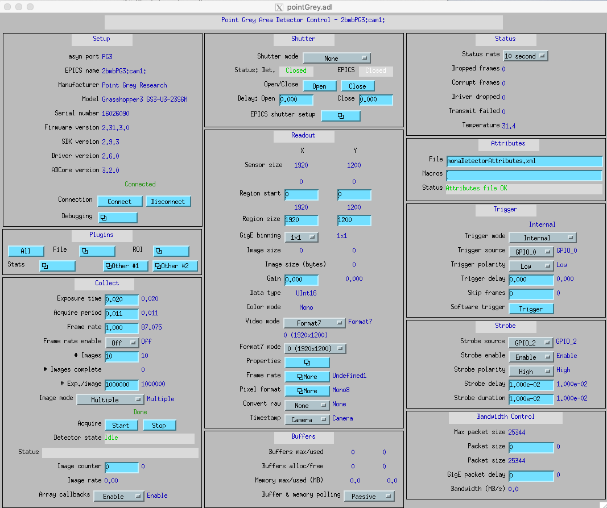

Detector
========

.. contents:: 
   :local:

These are the model/part number of the detectors in use at 2-BM. 

.. _camera_00001:  https://www.ptgrey.com/grasshopper3-91mp-mono-usb3-vision-sony-icx814-camera        
.. _camera_00002:  https://www.ptgrey.com/grasshopper3-23-mp-mono-usb3-vision-sony-pregius-imx174-camera        
.. _camera_00003:  https://www.ptgrey.com/grasshopper3-50-mp-mono-usb3-vision-sony-pregius-imx250         
.. _camera_00004:  http://www.pco.de/fileadmin/user_upload/pco-product_sheets/pco.dimax_hs_data_sheet.pdf       
.. _camera_00005:  https://www.pco.de/scmos-cameras/pcoedge-42/       
.. _camera_00006:  http://www.adimec.com/en/Service_Menu/Industrial_camera_products/High_performance_cameras_for_the_machine_vision_applications/QUARTZ_series_High_speed_CMOS_global_shutter_cameras/Quartz_quad_CoaXPress_12_Megapixels_187fps   
.. _camera_00007:  https://www.ptgrey.com/oryx-50-mp-mono-10gige-sony-imx250         

.. |d00004| image:: ../img/flir.png
   :width: 20px
   :alt: flir

+-------------------------------------------------------------+--------------+---------+------------+--------------------+-----------------------+-----------------------------+
|                   Detector                                  | pixels (HxV) |   bit   | fps        |      Manual        | Part number           |       Images                |
+=============================================================+==============+=========+============+====================+=======================+=============================+
| Grasshopper3 9.1 MP Mono USB3 Vision (Sony ICX814)          | 3376 x 2704  | 14      | 9          |     camera_00001_  | GS3-U3-91S6M-C        |                             |
+-------------------------------------------------------------+--------------+---------+------------+--------------------+-----------------------+-----------------------------+
| Grasshopper3 2.3 MP Mono USB3 Vision (Sony Pregius IMX174)  | 1920 x 1200  | 10      | 163        |     camera_00002_  | GS3-U3-23S6M-C        |                             |
+-------------------------------------------------------------+--------------+---------+------------+--------------------+-----------------------+-----------------------------+
| Grasshopper3 5.0 MP Mono USB3 Vision (Sony Pregius IMX250)  | 2448 x 2048  | 10      | 75         |     camera_00003_  | GS3-U3-51S5M-C        |                             |
+-------------------------------------------------------------+--------------+---------+------------+--------------------+-----------------------+-----------------------------+
| PCO DIMAX HS4                                               | 2000 x 2000  | 12      | 100 (2277) |     camera_00004_  | camera link           |  |d00001| |d00002| |d00003| |
+-------------------------------------------------------------+--------------+---------+------------+--------------------+-----------------------+-----------------------------+
| PCO EDGE 4.2                                                | 2048 x 2048  | 16      | 100        |     camera_00005_  | camera link           |                             |
+-------------------------------------------------------------+--------------+---------+------------+--------------------+-----------------------+-----------------------------+
| Adimec 12 MP                                                | 4000 x 3000  | 8       | 187        |     camera_00006_  | Quartz quad CoaXPress |                             |
+-------------------------------------------------------------+--------------+---------+------------+--------------------+-----------------------+-----------------------------+
| Oryx 5.0 MP Mono 10GigE                                     | 2448 x 2048  | 8-12    | 162        |     camera_00007_  | ORX-10G-51S5M-C       |           |d00004|          |
+-------------------------------------------------------------+--------------+---------+------------+--------------------+-----------------------+-----------------------------+

() Only applies to detector with on board memory, transfer speed to on boad memory. 

FLIR
----

To use the Flir Oryx installed at 2-BM-A and connected to pg10ge::

  [user2bmb@pg10ge]$ start_tomo

then select FLIR Oryx from:

to obtain the FLIR Oryx areadetector main control screen:

To collect an image press Acquire Start.

Startup
~~~~~~~

.. contents:: 
   :local:

To start/stop the area detector IOC for the FLIR Oryx (model 10GS 51S5) camera login into user2bmb@pg10ge then type::

    [user2bmb@pg10ge]$ ~/2bmbOryx.sh -h
    Usage: 2bmbOryx.sh {start|stop|restart|status|console|run|medm}

FLIR Manuals
~~~~~~~~~~~~

- `Installation Guide <https://anl.box.com/s/7pe793z5x9cspayqimscavzqhdcc9og7>`_
- `Technical Reference <https://anl.box.com/s/iyysb20lkr9uwbbefy3s0n2pkq3lyktq>`_

Point Grey
----------

To use the Point Grey GS3-U3-23S6M-C installed at 2-BM-B and connected to lyra::

  [user2bmb@lyra]$ start_mona

then select MONA/User/detectors/Point Grey camera (PG3) to obtain the Point Grey areadetector main control screen:

To collect an image press Acquire Start.

Startup
~~~~~~~

.. contents:: 
   :local:

To start/stop the areadetector IOC for the Point Grey (model GS3-U3-23S6M-C) camera login into user2bmb@lyra then type::

    [user2bmb@lyra]$ 2bmbPG3 
     Usage: 2bmbPG3.sh {start|stop|restart|status|console|run}
    [user2bmb@lyra]$ 2bmbPG3 status 
    [user2bmb@lyra]$ 2bmbPG3 start 

