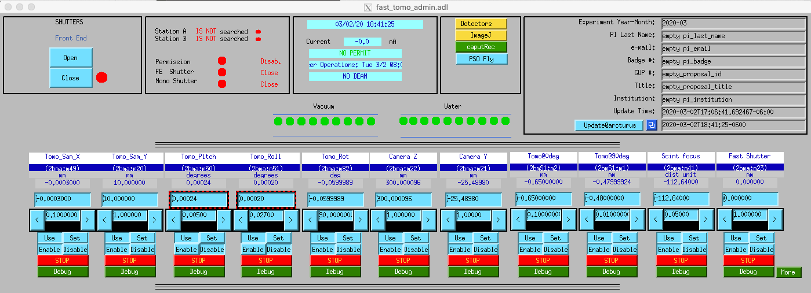

Sample
======

Environment
-----------

The 2-BM microCT instrument has been designed to accomodate different kind of *in situ* cells.

Furnace
~~~~~~~

+----------------+--------------+------------+---------+-------------------------+------+-------------------+----+-----------------------------------------------------------------------------------------------------------------------------------+
|  Type          | Temp. Range  | Atmosphere |  Image  | Contact                 | Loan |  Info             |    | More info                                                                                                                         |
+----------------+--------------+------------+---------+-------------------------+------+-------------------+----+-----------------------------------------------------------------------------------------------------------------------------------+
| Induction      | up to 1000 °C| Air        | |00001| | `Pavel Shevchenko`_     | Ask  |  `box link 0001`_ |  1 | Custom: water cooled                                                                                                              |
+----------------+--------------+------------+---------+-------------------------+------+-------------------+----+-----------------------------------------------------------------------------------------------------------------------------------+
| Induction      | up to 1500 °C| Air        | |00002| | `Alex Deriy`_           | Ask  |  `box link 0002`_ |  2 | Commercial parts: `THM 200 heater`_, `BK power supply`_, `PTC 10 controller`_, `3 AWG welding wires`_, plus custom water cooler   |
+----------------+--------------+------------+---------+-------------------------+------+-------------------+----+-----------------------------------------------------------------------------------------------------------------------------------+

.. _THM 200 heater: https://mhi-inc.com/microtube_heaters.html
.. _BK power supply: https://www.bkprecision.com/products/power-supplies/1693-1-15v-60a-switching-dc-power-supply-with-remote-sense.html
.. _PTC 10 controller: https://www.thinksrs.com/products/ptc10.html
.. _3 AWG welding wires: https://www.mcmaster.com/welding-wire

.. _box link 0001: https://anl.box.com/s/9qeu4xcm0bahty4pxgj7qhgt87277vci
.. _box link 0002: https://anl.box.com/s/i6t27uspatnpqdlhcne9pitkhg3m3axm

.. |00001| image:: ../img/furnace_00001.png
    :width: 20pt
    :height: 20pt

.. |00002| image:: ../img/furnace_00002.png
    :width: 20pt
    :height: 20pt

.. _Pavel Shevchenko: mail to:  pshevchenko@anl.gov
.. _Alex Deriy: mail to: deriy@anl.gov

The furnaces use a Eurotherm temperature controller. To access the MEDM screen select Eurotherm on:

.. image:: ../img/eurotherm.png
    :width: 512pt
    :height: 300pt

Pressure
~~~~~~~~

+--------------------------------+--------------+-------------------+----------+--------------------------------------------+-------------------------+---------------------------+------+
| Type                           | Temp. Range  | Pressure          |  Image   | Commercial                                 | Contact                 |  Info                     |      |
+--------------------------------+--------------+-------------------+----------+--------------------------------------------+-------------------------+---------------------------+------+
| Teledyne ISCO 65D Syringe Pump |      -       | up to 20,000 psi  | |p00001| | Yes                                        | `Mark Rivers`_          |  `box link p0001`_        |  1   |
+--------------------------------+--------------+-------------------+----------+--------------------------------------------+-------------------------+---------------------------+------+
| Teledyne 1000D Syringe Pump    |   120 °C     | up to 12,000 psi  | |p00002| | Yes                                        | `Pavel Shevchenko`_     |  `box link p0002`_        |  1   |
+--------------------------------+--------------+-------------------+----------+--------------------------------------------+-------------------------+---------------------------+------+
| Vindum VP-12K dual-piston Pump |   120 °C     | up to 12,000 psi  | |p00003| | Yes                                        | `Mark Rivers`_          |  `web link p0003`_        |  1   |
+--------------------------------+--------------+-------------------+----------+--------------------------------------------+-------------------------+---------------------------+------+

Epics support for the pumps: https://github.com/epics-modules/SyringePump. Note: modbus version should be R3-2 (or higher). To run the Teledyne 1000D Syringe Pump at 2-BM::

    [user2bmb@arcturus,478,~]$ cd ~/epics/synApps/support/syringepump/iocBoot/iocISCO 
        
::

    [user2bmb@arcturus,478,~]$ ./start_IOC 
    
    [user2bmb@arcturus,478,~]$ ./start_medm

opens the pump control screen:

.. image:: ../img/pump_00001.png
   :width: 340px
   :align: center
   :alt: tomo_user

.. _box link p0001: https://anl.box.com/s/3xw458cbs0t1k80l2jzxjon148uftqqq
.. _box link p0002: https://anl.box.com/s/3xw458cbs0t1k80l2jzxjon148uftqqq
.. _web link p0003: https://vindum.com/products/vp-series-high-pressure-metering-pumps

.. |p00001| image:: ../img/press_00001.png
    :width: 20pt
    :height: 20pt

.. |p00002| image:: ../img/press_00002.png
    :width: 20pt
    :height: 20pt

.. |p00003| image:: ../img/press_00003.png
    :width: 20pt
    :height: 20pt

.. _Pavel Shevchenko: mail to:  pshevchenko@anl.gov
.. _Mark Rivers: mail to:  rivers@cars.uchicago.edu

Battery cell
~~~~~~~~~~~~

to be completed

Mounting
--------

Samples are mounted on a `custom tip <https://anl.app.box.com/folder/123584924093>`_ as shown below:

.. image:: ../img/sample_kinematic.png 
   :width: 140px
   :align: center
   :alt: tomo_user

this is mounted on the rotary stage using a `KBT25 <http://www.thorlabs.com/thorProduct.cfm?partNumber=KBT25/M>`_/`KBB25 <http://www.thorlabs.com/thorProduct.cfm?partNumber=KBB25/M>`_ pair. New `KBT25T kinematic <http://www.thorlabs.com/thorProduct.cfm?partNumber=KBT25T/M>`_ could also be used.

Alignment
---------

| In order to align the sample on the center of rotation of the rotary stage 4 motorized axis are needed:
|
| • **Sample Y** (vertical motion)
| • **Sample X** (horizontal motion perpendicular to the beam)
| • **Sample top X** (horizontal motion above the rotary stage)
| • **Sample top Z** (horizontal motion normal to "sample top X" above the rotary stage)

.. image:: ../img/tomo_refs.png 
   :width: 480px
   :align: center
   :alt: tomo_user

Load the sample on the kinematic mount (if using the automatic alignemt cli `Adjust <https://github.com/xray-imaging/adjust>`_ use the `tungsten sphere <https://www.vxb.com/0-5mm-Tungsten-Carbide-One-0-0197-inch-Dia-p/0-5mmtungstenballs.htm>`_ as sample) then using:

move the sample up/down by adjusting Tomo_Sam_Y in the positive/negative direction until the sample is in the field of view of detector. 

Automatic
~~~~~~~~~

`Adjust <https://github.com/xray-imaging/adjust>`_ is a python script that automates all tomography instrument alignemt taks.

`Adjust <https://github.com/xray-imaging/adjust>`_  works in combination with a 0.5 mm `tungsten sphere <https://www.vxb.com/0-5mm-Tungsten-Carbide-One-0-0197-inch-Dia-p/0-5mmtungstenballs.htm>`_ that needs to be installed as a sample on top of the rotary stage making sure is in the field of view at least when the rotation axis is at 0 and 10 degrees.

`Adjust <https://github.com/xray-imaging/adjust>`_'s funtions include automatic finding of:

- detector pixel size
- scintillator focus location
- rotation axis location
- centering of the sample on the rotation axis
- rotation axis pitch and roll

First step is to mesaure the image pixel size by running::

    user2bmb@pg10ge $ adjust resolution

then::

    user2bmb@pg10ge $ adjust focus
    user2bmb@pg10ge $ adjust center
    user2bmb@pg10ge $ adjust roll
    user2bmb@pg10ge $ adjust pitch

Manual 
~~~~~~

To center the sample on the rotation axis move the rotary stage Tomo_Rot at 0\ :sup:`o` then by adjusting the motor called "Tomo@0deg" (which is the sample stage on top of the rotary stage moving in the X director when the rotary stage at 0\ :sup:`o`) move the sample towards the center of the field of view. Finally move the Tomo_Rot at 180\ :sup:`o` then by adjusting the motor called "Tomo@1800deg" (which is the sample stage on top of the rotary stage moving in the X director when the rotary stage at 180\ :sup:`o`) move again the sample towards the center. The same process is described in the 4 steps below:

.. image:: ../img/sample_alignment.png
   :width: 1200px
   :align: center
   :alt: project

| **Note**: "Tomo_Sam_X" is used to align the center of rotation in respect to the beam, not to align samples on the rotation axis. While moving the sample vertically with Tomo_Sam_Y, some parasitic motions might detune "Tomo_Sam_X" by few μm. Therefore, it is expected to realign Tomo_Sam_X from one sample to another but only within few μm range.

