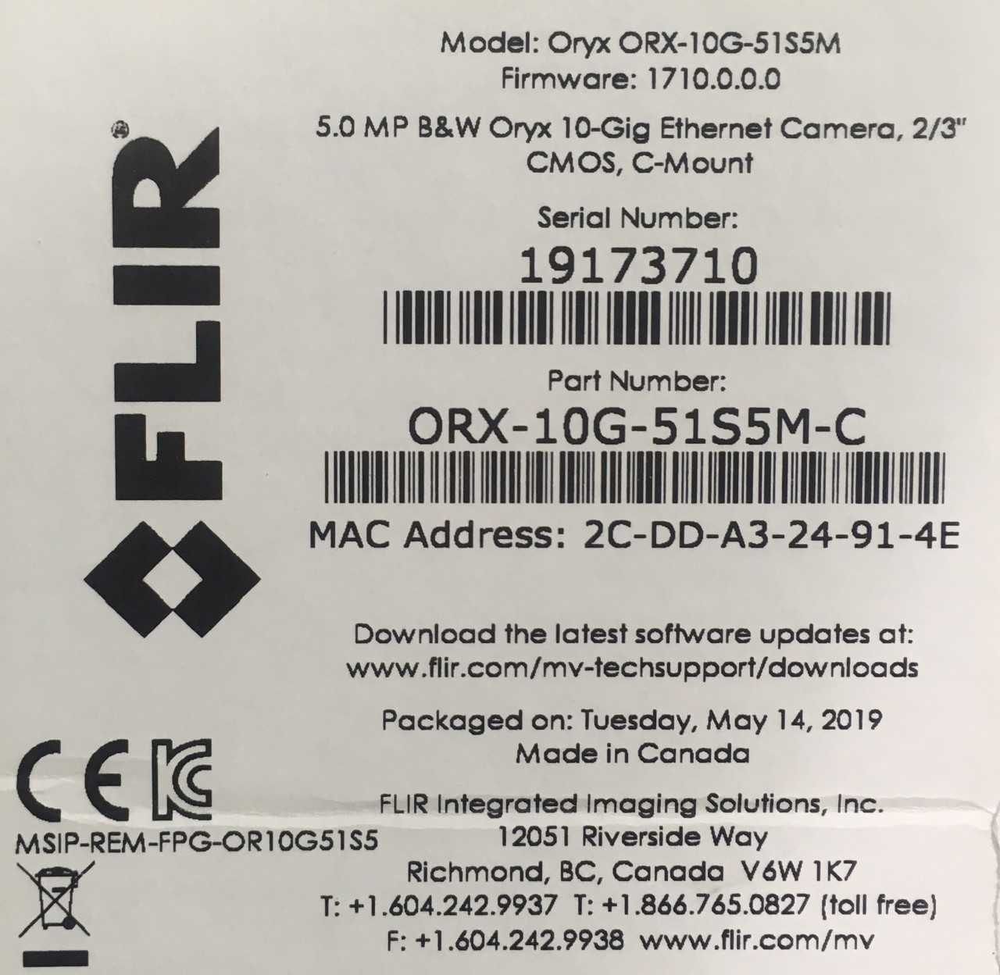
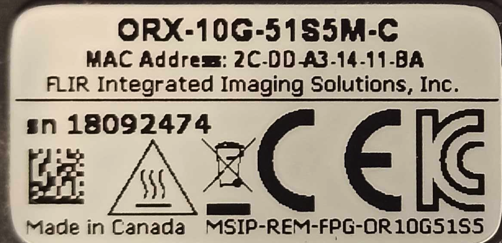
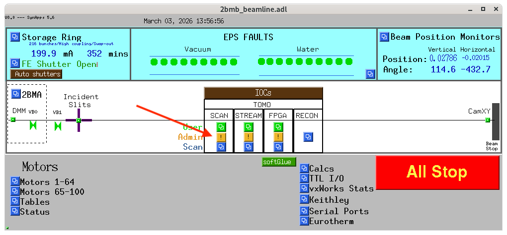
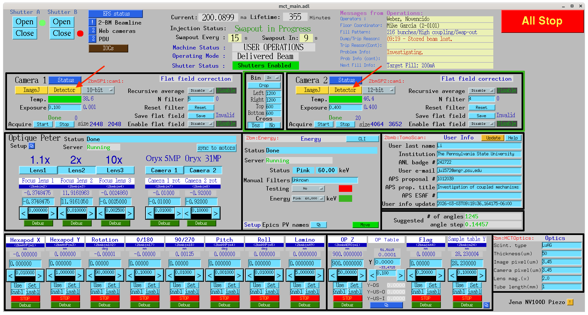
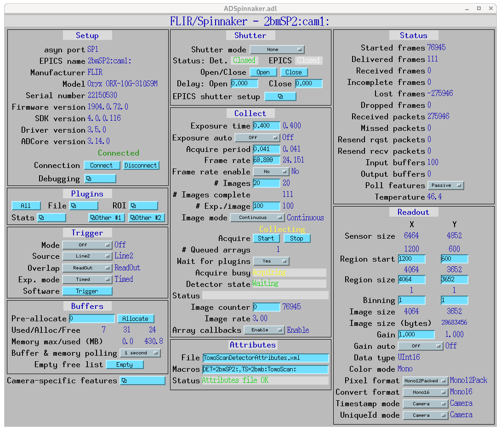
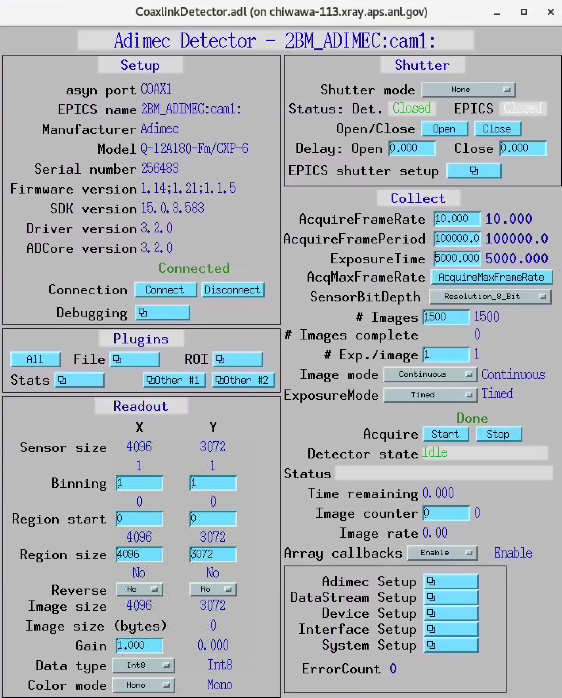
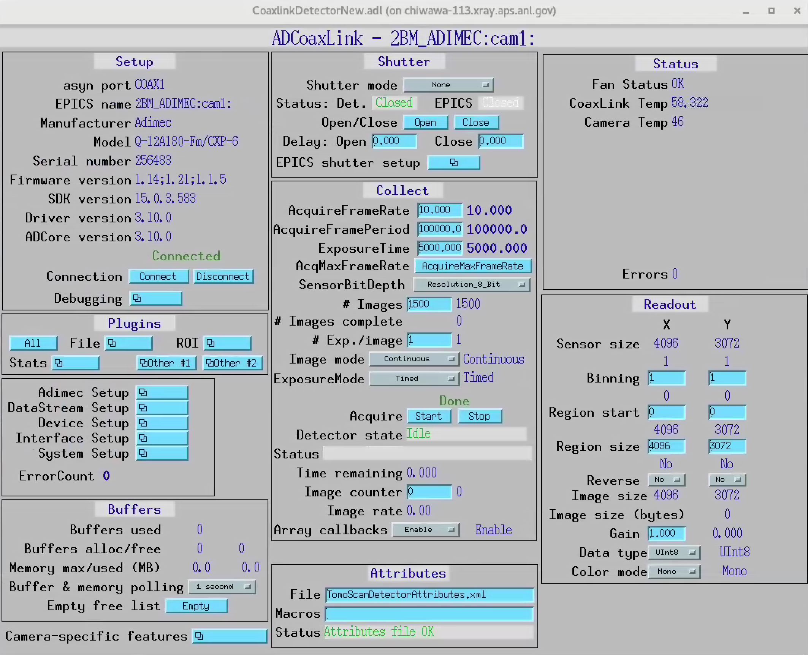
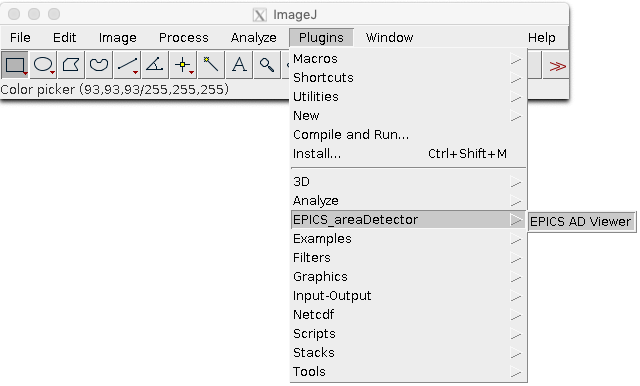

Detection
=========

The detection system consists of camera, lens and scintillator screens. Below we list of all the camera, lens and scintillator screens options available at 2-BM.

These are the computers supporting detectors at 2-BM:

+-----------+--------------+-------------------+-----------------+--------------------------+---------------------+
| Station   | Name         |      Model        |  Product No.    |    Serial No.            |        Manual       |
+-----------+--------------+-------------------+-----------------+--------------------------+---------------------+
| 2-BM-A    | pg10ge       |  HP Z8 G4         | 3GF37UT#ABA     |  `pg10ge label`_         |     `pg10ge SM`_    |
+-----------+--------------+-------------------+-----------------+--------------------------+---------------------+
| 2-BM-B    | lyra         |  HP EliteDesk 800 | P4K18UT#ABA     |  `lyra label`_           |     `lyra SM`_      |
+-----------+--------------+-------------------+-----------------+--------------------------+---------------------+

For each machine part list at purchase time and for the list of supported hardware enter the serial numeber in the `HP support <https://partsurfer.hp.com/Search.aspx>`_ web page.

.. _pg10ge label: https://anl.box.com/s/oslaky958be3vyifda2xyq4tv0v9v7pz
.. _pg10ge SM: https://anl.box.com/s/m1u8o62wbr27n26iotfnbhgpncwsapcq
.. _lyra label: https://anl.box.com/s/lrjiwsfzwbe51gueb6vpyinqav86qx6o
.. _lyra SM: https://anl.box.com/s/dv0ub0gdjhs7q3h50ehgro6gaesbxcjf

These are the model/part number of the cameras in use at 2-BM:

.. _camera_00001:  https://www.ptgrey.com/grasshopper3-91mp-mono-usb3-vision-sony-icx814-camera        
.. _camera_00002:  https://www.ptgrey.com/grasshopper3-23-mp-mono-usb3-vision-sony-pregius-imx174-camera        
.. _camera_00003:  https://www.ptgrey.com/grasshopper3-50-mp-mono-usb3-vision-sony-pregius-imx250         
.. _camera_00004:  http://www.pco.de/fileadmin/user_upload/pco-product_sheets/pco.dimax_hs_data_sheet.pdf       
.. _camera_00005:  https://www.pco.de/scmos-cameras/pcoedge-42/       
.. _camera_00006:  https://www.adimec.com/cameras/machine-vision-cameras/quartz-series/q-12a180/   
.. _camera_00007:  https://www.flir.com/products/oryx-10gige/?model=ORX-10GS-51S5M-C&vertical=machine+vision&segment=iis
.. _camera_00008:  https://www.flir.com/products/oryx-10gige/?model=DEV-ORX-310S9M&vertical=machine+vision&segment=iis

.. _camera_order_00001: https://apps.inside.anl.gov/paris/req.jsp?reqNbr=F6-109062
.. _camera_order_00002: https://apps.inside.anl.gov/paris/req.jsp?reqNbr=F8-219026
.. _camera_order_00003: https://apps.inside.anl.gov/paris/req.jsp?reqNbr=F6-161074
.. _camera_order_00004: https://apps.inside.anl.gov/paris/req.jsp?reqNbr=G2-175013

.. |d00001| image:: ../img/dimax_01.png
   :width: 50px
   :alt: dimax_01

.. |d00002| image:: ../img/dimax_02.png
   :width: 50px
   :alt: dimax_02

.. |d00003| image:: ../img/dimax_03.png
   :width: 50px
   :alt: dimax_03

.. |d00006| image:: ../img/flir_2.png
   :width: 50px
   :alt: flir

+-------------------------------------------------------------+--------------+------------------+---------+------------+--------------------+-----------------------------------------+-----------------------------+-------------------------------+
|                   Camera                                    | pixels (HxV) | pixels size (μm) |   bit   | fps        |      Manual        | Part number                             |        Images               |          Purchase orider      |
+=============================================================+==============+==================+=========+============+====================+=========================================+=============================+===============================+
| Grasshopper3 9.1 MP Mono USB3 Vision (Sony ICX814)          | 3376 x 2704  |       3.69       | 14      | 9          |     camera_00001_  | GS3-U3-91S6M-C                          |                             |   camera_order_00001_         |
+-------------------------------------------------------------+--------------+------------------+---------+------------+--------------------+-----------------------------------------+-----------------------------+-------------------------------+
| Grasshopper3 2.3 MP Mono USB3 Vision (Sony Pregius IMX174)  | 1920 x 1200  |       5.86       | 10      | 163        |     camera_00002_  | GS3-U3-23S6M-C                          |                             |   camera_order_00001_         |
+-------------------------------------------------------------+--------------+------------------+---------+------------+--------------------+-----------------------------------------+-----------------------------+-------------------------------+
| Grasshopper3 5.0 MP Mono USB3 Vision (Sony Pregius IMX250)  | 2448 x 2048  |       3.45       | 10      | 75         |     camera_00003_  | GS3-U3-51S5M-C                          |                             |   camera_order_00001_         |
+-------------------------------------------------------------+--------------+------------------+---------+------------+--------------------+-----------------------------------------+-----------------------------+-------------------------------+
| PCO DIMAX HS4                                               | 2000 x 2000  |      11          | 12      | 100 (2277) |     camera_00004_  | camera link                             |  |d00001| |d00002| |d00003| |                               |
+-------------------------------------------------------------+--------------+------------------+---------+------------+--------------------+-----------------------------------------+-----------------------------+-------------------------------+
| PCO EDGE 4.2                                                | 2048 x 2048  |       6.5        | 16      | 100        |     camera_00005_  | camera link                             |                             |                               |
+-------------------------------------------------------------+--------------+------------------+---------+------------+--------------------+-----------------------------------------+-----------------------------+-------------------------------+
| Adimec 12 MP (*)                                            | 4000 x 3000  |       5.5        | 8       | 187        |     camera_00006_  | Quartz quad CoaXPress Q-12A180 CMV12000 |                             |   camera_order_00003_         |
+-------------------------------------------------------------+--------------+------------------+---------+------------+--------------------+-----------------------------------------+-----------------------------+-------------------------------+
| Oryx 5.0 MP Mono 10GigE                                     | 2448 x 2048  |       3.45       | 8-12    | 162        |     camera_00007_  | ORX-10G-51S5M-C                         |   |d00004| |d00005|         |   camera_order_00002_         |
+-------------------------------------------------------------+--------------+------------------+---------+------------+--------------------+-----------------------------------------+-----------------------------+-------------------------------+
| Oryx 31.0 MP Mono 10GigE                                    | 6464 x 4852  |       3.45       | 8-12    | 26         |     camera_00008_  | ORX-10G-310S9M                          |   |d00006|                  |   camera_order_00004_         |
+-------------------------------------------------------------+--------------+------------------+---------+------------+--------------------+-----------------------------------------+-----------------------------+-------------------------------+

(*) used with Euresys Quad-G3 CXP framegrabber

() Only applies to detector with on board memory, transfer speed to on boad memory. 

Different combinations of camera, lens and scintillator screensare are possible allowing for flexible data collection speed, pixel size, resolution and field of view.  Here are few examples:

+-------------+-------------+---------------------------------+-----------+-----------------------------+----------------------------+------------------------+
|  Pixels (H) |  Pixels (V) | Detector pixel size  (μm)       |  Lens Mag |   Sample pixel size (μm)    |    H filed of view (mm)    |  V filed of view (mm)  |
+=============+=============+=================================+===========+=============================+============================+========================+
|     2448    |     2048    |          3.45                   |      2    |          1.73               |         4.22               |     3.53               | 
+-------------+-------------+---------------------------------+-----------+-----------------------------+----------------------------+------------------------+
|     2448    |     2048    |          3.45                   |      5    |          0.69               |         1.69               |     1.41               | 
+-------------+-------------+---------------------------------+-----------+-----------------------------+----------------------------+------------------------+
|     2448    |     2048    |          3.45                   |      7.5  |          0.46               |         1.13               |     0.94               | 
+-------------+-------------+---------------------------------+-----------+-----------------------------+----------------------------+------------------------+
|     2448    |     2048    |          3.45                   |      10   |          0.35               |         0.84               |     0.71               | 
+-------------+-------------+---------------------------------+-----------+-----------------------------+----------------------------+------------------------+
|     2448    |     2048    |          3.45                   |      20   |          0.17               |         0.42               |     0.35               | 
+-------------+-------------+---------------------------------+-----------+-----------------------------+----------------------------+------------------------+
|     2448    |     2048    |          6.5                    |      2    |          3.25               |         7.96               |     6.66               | 
+-------------+-------------+---------------------------------+-----------+-----------------------------+----------------------------+------------------------+
|     2448    |     2048    |          6.5                    |      5    |          1.30               |         3.18               |     2.66               | 
+-------------+-------------+---------------------------------+-----------+-----------------------------+----------------------------+------------------------+
|     2448    |     2048    |          6.5                    |      7.5  |          0.87               |         2.12               |     1.77               | 
+-------------+-------------+---------------------------------+-----------+-----------------------------+----------------------------+------------------------+
|     2448    |     2048    |          6.5                    |      10   |          0.65               |         1.59               |     1.33               | 
+-------------+-------------+---------------------------------+-----------+-----------------------------+----------------------------+------------------------+
|     2448    |     2048    |          6.5                    |      20   |          0.33               |         0.80               |     0.67               | 
+-------------+-------------+---------------------------------+-----------+-----------------------------+----------------------------+------------------------+

FLIR
----

To use the Flir Oryx camera ORX-10G-51S5M installed at 2-BM-B and connected to pg10ge::

  [user2bmb@parcturus]$ start_epics

then select Scan/Admin from:

to obtain the FLIR Oryx areadetector main control in the mct_main screen select:

To collect an image press Acquire Start.

Startup
~~~~~~~

.. contents:: 
   :local:

To start/stop the area detector IOC for the FLIR Oryx (model 10GS 51S5) camera login into user2bmb@pg10ge then type::

    [user2bmb@pg10ge]$ 2bmbOryx -h
    Usage: 2bmbSpinnaker.sh {start|stop|restart|status|console|run|medm|caqtdm}

Manuals
~~~~~~~

- `FLIR Installation Guide <https://anl.box.com/s/7pe793z5x9cspayqimscavzqhdcc9og7>`_
- `FLIR Technical Reference <https://anl.box.com/s/iyysb20lkr9uwbbefy3s0n2pkq3lyktq>`_

Point Grey
----------

To use the Point Grey GS3-U3-23S6M-C installed at 2-BM-B and connected to lyra::

  [user2bmb@lyra]$ start_mona

then select MONA/User/detectors/Point Grey camera (PG3) to obtain the Point Grey areadetector main control screen:

.. image:: ../img/item_007.png 
   :width: 720px
   :align: center
   :alt: tomo_user

To collect an image press Acquire Start.

Startup
~~~~~~~

.. contents:: 
   :local:

To start/stop the areadetector IOC for the Point Grey (model GS3-U3-23S6M-C) camera login into user2bmb@lyra then type::

    [user2bmb@lyra]$ 2bmbPG3 
     Usage: 2bmbPG3.sh {start|stop|restart|status|console|run}
    [user2bmb@lyra]$ 2bmbPG3 status 
    [user2bmb@lyra]$ 2bmbPG3 start 

Manuals
~~~~~~~

- `PG Installation Guide <https://anl.box.com/s/ds559pqv1rsq8fmxdavyjycio4n3a7e0>`_
- `PG Technical Reference <https://anl.box.com/s/52w064y82yura524d9fkz27yst39597v>`_

Adimec
------

To use the Quartz quad CoaXPress Q-12A180 CMV12000 installed at 2-BM-A and connected to chiwawa-113, 
start the Adimec areadetector main control screen

Old version::

   [user2bmb@chiwawa-113]$ cd /local/epics/areaDetector-3-2/ADCoaxLink/iocs/coaxLinkIOC/iocBoot/iocCoaxLink
   [user2bmb@chiwawa-113]$ ./Start_Adimec_Display.sh
   [user2bmb@chiwawa-113]$ ./Start_Adimec.sh

New version::

  [user2bmb@chiwawa-113]$ cd /net/s2dserv/xorApps/PreBuilts/areaDetector-R3-10/ADCoaxLink/iocs/coaxLinkIOC/iocBoot/iocCoaxLink/softioc/
  [user2bmb@chiwawa-113]$ ./Adimec.sh
    Usage: Adimec.sh {start|stop|restart|status|console|run|medm|caqtdm}
    Additional options:
    Adimec.sh start {screen|procServ|ps|shell}

Startup
~~~~~~~

.. contents:: 
   :local:

To start/stop the areadetector IOC for the  Quartz quad CoaXPress Q-12A180 CMV12000  camera login into user2bmb@chiwawa-113 then type::

  [user2bmb@chiwawa-113]$ cd /net/s2dserv/xorApps/PreBuilts/areaDetector-R3-10/ADCoaxLink/iocs/coaxLinkIOC/iocBoot/iocCoaxLink/softioc/
  [user2bmb@chiwawa-113]$ ./Adimec.sh
    Usage: Adimec.sh {start|stop|restart|status|console|run|medm|caqtdm}
    Additional options:
    Adimec.sh start {screen|procServ|ps|shell}

Old version::

   [user2bmb@chiwawa-113]$ cd /local/epics/areaDetector-3-2/ADCoaxLink/iocs/coaxLinkIOC/iocBoot/iocCoaxLink
   [user2bmb@chiwawa-113]$ ./Start_Adimec.sh

To collect an image press Acquire Start.

Manuals
~~~~~~~

- `Adimec Installation Guide <https://anl.box.com/s/zyyt72lhttnhksgnwi2f02p8wbsoz9r7>`_
- `Adimec Technical Reference <https://anl.box.com/s/zyyt72lhttnhksgnwi2f02p8wbsoz9r7>`_

Lenses
------

These are the model/part number of the microscope objective available at  at 2-BM:

.. _lens_order_00001: https://apps.inside.anl.gov/paris/req.jsp?reqNbr=F0-144093
.. _lens_order_00002: https://apps.inside.anl.gov/paris/req.jsp?reqNbr=F1-153142
.. _lens_order_00003: https://apps.inside.anl.gov/paris/req.jsp?reqNbr=F1-165089

+-------------+------+------------------+-----------------+--------------------+----------------+
|    Brand    | each |   Part Number    |  Magnification  |       WD (mm)      |       NA       |
+=============+======+==================+=================+====================+================+
|  Mitutoyo   |   3x |   NT-46-142      |        2x       |        34          |     0.055      |
+-------------+------+------------------+-----------------+--------------------+----------------+
|  Mitutoyo   |   3x |   NT46-143       |        5x       |        34          |     0.14       |
+-------------+------+------------------+-----------------+--------------------+----------------+
|  Mitutoyo   |   3x |   NT66-383       |      7.5x       |        35          |     0.21       |
+-------------+------+------------------+-----------------+--------------------+----------------+
|  Mitutoyo   |   3x |   NT46-144       |     10x         |        34          |     0.28       |
+-------------+------+------------------+-----------------+--------------------+----------------+
|  Mitutoyo   |   2x |   NT46-145       |     20x         |        20          |     0.42       |
+-------------+------+------------------+-----------------+--------------------+----------------+

The purchase record can be found at lens_order_00001_, lens_order_00002_, lens_order_00003_.

Scintillators
-------------

.. _esrf1_specs: https://anl.box.com/s/0q3bc124x4ai5pnkt01vmbimduwnubee
.. _esrf1_order: https://apps.inside.anl.gov/paris/req.jsp?reqNbr=F6-161076
.. _esrf2_specs: https://anl.box.com/s/wo4ph36t29hw88dkt8ip1rfmunl31nnq
.. _esrf2_order: https://apps.inside.anl.gov/paris/req.jsp?reqNbr=G2-069073
.. _marketech_order: https://apps.inside.anl.gov/paris/req.jsp?reqNbr=F6-161075
.. _crytur_order_01: https://apps.inside.anl.gov/paris/req.jsp?reqNbr=F3-119046
.. _crytur_order_02: https://apps.inside.anl.gov/paris/req.jsp?reqNbr=F1-153126

+-------------+------------------+-----------------+----------------+---------------------------+-------------------------+
|    Source   |       Type       |  Thickness (μm) |   Size (mm)    |  Specification            |     Order Ref.          |
+=============+==================+=================+================+===========================+=========================+
|     ESRF    |      GGG:Eu      |         2       |     8 x 8      |     esrf1_specs_          |   esrf1_order_          |
+-------------+------------------+-----------------+----------------+---------------------------+-------------------------+
|     ESRF    |      GGG:Eu      |         5       |     8 x 8      |     esrf1_specs_          |   esrf1_order_          |
+-------------+------------------+-----------------+----------------+---------------------------+-------------------------+
|     ESRF    |      GGG:Eu      |        23       |     8 x 8      |     esrf1_specs_          |   esrf1_order_          |
+-------------+------------------+-----------------+----------------+---------------------------+-------------------------+
|     ESRF    |      LOS:Tb      |         6       |     8 x 8      |     esrf1_specs_          |   esrf1_order_          |
+-------------+------------------+-----------------+----------------+---------------------------+-------------------------+
|     ESRF    |      GGG:Eu      |        17       |     8 x 8      |     esrf2_specs_          |   esrf2_order_          |
+-------------+------------------+-----------------+----------------+---------------------------+-------------------------+
|     ESRF    |      GGG:Eu      |        21       |     8 x 8      |     esrf2_specs_          |   esrf2_order_          |
+-------------+------------------+-----------------+----------------+---------------------------+-------------------------+
|     ESRF    |      GGG:Eu      |        25       |     8 x 8      |     esrf2_specs_          |   esrf2_order_          |
+-------------+------------------+-----------------+----------------+---------------------------+-------------------------+
| Marketech   |     LuAG:Ce      |        100      |     25.4       |          -                |   marketech_order_      |
+-------------+------------------+-----------------+----------------+---------------------------+-------------------------+
| Marketech   |     LuAG:Ce      |        200      |     25.4       |          -                |   marketech_order_      |
+-------------+------------------+-----------------+----------------+---------------------------+-------------------------+
| Crytur      |     LuAG:Ce      |         20      |     10         |          -                |   crytur_order_01_      |
+-------------+------------------+-----------------+----------------+---------------------------+-------------------------+
| Crytur      |     LuAG:Ce      |         25      |     10         |          -                |   crytur_order_01_      |
+-------------+------------------+-----------------+----------------+---------------------------+-------------------------+
| Crytur      |     LuAG:Ce      |         10      |     10         |  glued on 1 mm quartz.    |   crytur_order_01_      |
+-------------+------------------+-----------------+----------------+---------------------------+-------------------------+
| Crytur      |     LuAG:Ce      |         10      |     10         |  glued on 0.17 mm quartz  |   crytur_order_01_      |
+-------------+------------------+-----------------+----------------+---------------------------+-------------------------+
| Crytur      |     LuAG:Ce      |         50      |     25.5       |          -                |   crytur_order_02_      |
+-------------+------------------+-----------------+----------------+---------------------------+-------------------------+

Below are the emission spectrum plots of common scintillator screens:

.. image:: ../img/scintillator_qe_01.png
   :width: 320px
   :align: center
   :alt: tomo_user 

.. image:: ../img/scintillator_qe_02.png
   :width: 320px
   :align: center
   :alt: tomo_user 

CCD Lens calculator
-------------------

To calculate the pixel size / resolution for an arbitrary lens/scintillator/detector combination you can use the `CCD Lens calculator`_ to obtain the following:

.. image:: ../img/CCD_Lenses_calculator.png
   :width: 320px
   :align: center
   :alt: tomo_user 

.. _CCD Lens calculator: https://anl.box.com/s/800n760yv7dx1332yt2rk1znstpa7wtq

Visualization
-------------

.. _ImageJ_Viewer: https://cars9.uchicago.edu/software/epics/areaDetectorViewers.html#ImageJViewers

To view the images collected by the detector press ImageJ on the main beamline control screen:

.. image:: ../img/item_004.png 
   :width: 128px
   :align: center
   :alt: tomo_user

then make sure the areaDetector plug-in for ImageJ, `ImageJ_Viewer`_,  is running select:

and press start at:

.. image:: ../img/item_006.png 
   :width: 480px
   :align: center
   :alt: tomo_user 

To open the hdf files saved by the detector use:

- fiji: https://imagej.net/Fiji 
- hdf: plugin from https://github.com/paulscherrerinstitute/ch.psi.imagej.hdf5
- hdfview https://support.hdfgroup.org/products/java/hdfview/
- argos https://github.com/titusjan/argos
