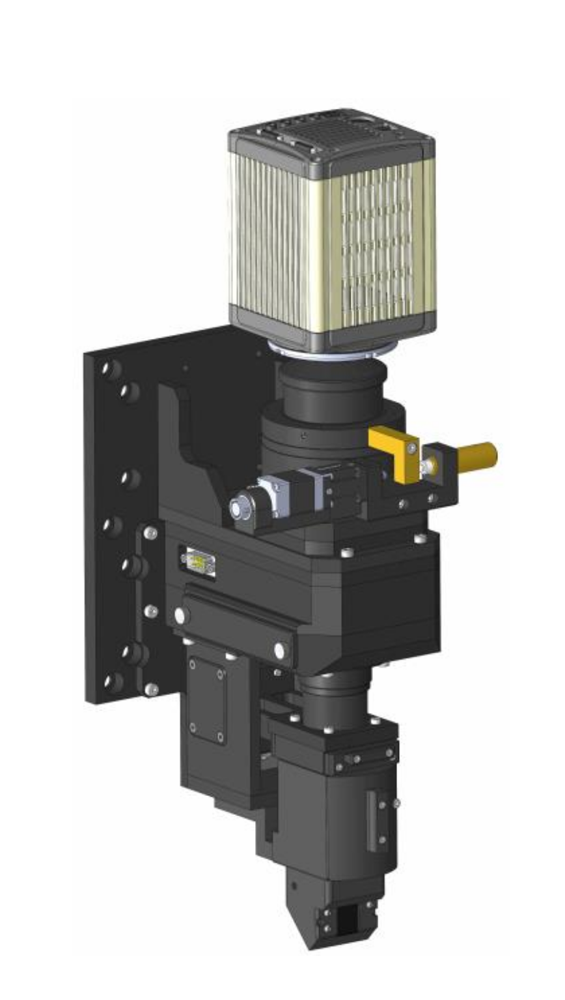

Visible Lens 
============

Imaging and tomography 
----------------------

We installed an `Optique Peter <http://www.optiquepeter.com/>`_ system for visible light detection

Single Objective
~~~~~~~~~~~~~~~~~

- `Manual <https://anl.box.com/s/djl0v91jjeuxz9oa72n2okipiagjnw3e>`_
- `Test Part 1 <https://anl.box.com/s/mrndbwfwqdgj31idfazakgd8stl0w86t>`_
- `Test Part 2 <https://anl.box.com/s/c5pbdkikbgh7j42n8p8hljstai2unc8v>`_
- `Ref single <https://anl.box.com/s/1dvyji993rioc46vl2p5bmvq62w3d8py>`_

Triple Objective
~~~~~~~~~~~~~~~~

.. image:: ../img/optique_peter_triple.png 
   :width: 720px
   :align: center
   :alt: tomo_user

- `Ref triple <https://anl.box.com/s/q3oe097q1r3u0jdux7o2idr042ljhq5d>`_
